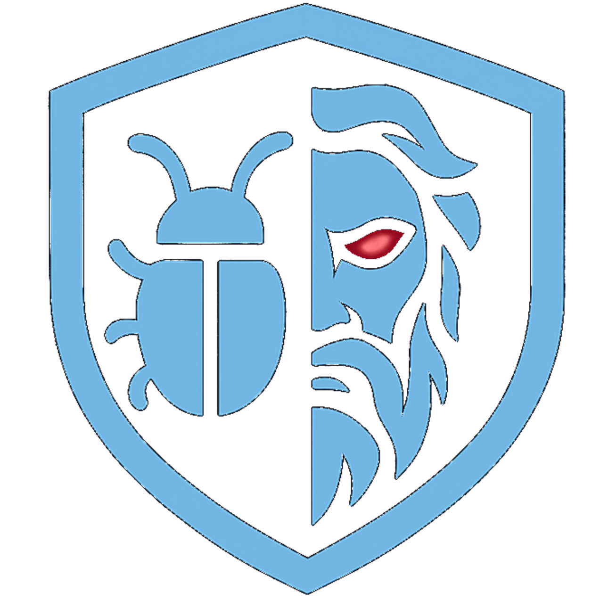

# Zeus Malware Clone

Zeus is a modernized, proof-of-concept malware variant inspired by the original Zeus botnet. This project demonstrates advanced evasion, persistence, and propagation techniques used in modern cyber threats.

## background
The Zeus trojan virus was first created in 2007, when hackers in Eastern Europe used it to target the United States Department of Transportation. While it’s hard to say for certain who created it, the attack really took off when its malicious code became public in 2011. Since then, it has spawned dozens of variants that have kept internet security experts and law enforcement busy.

## Core Features

- Stealth & Evasion
- Persistence Mechanisms
- Network Propagation
- C2 Communication
- Browser Injection

## Build Instructions

⚠️ change the C2 servers in the code

### Compilation

```bash 
g++ -o zeus.exe zeus.cpp -lws2_32 -liphlpapi -lnetapi32 -lurlmon -lwininet -lshlwapi -static -mwindows -O2
```

### Required Libraries

- Windows Socket API (ws2_32)
- IP Helper API (iphlpapi)
- Network Management API (netapi32)
- Internet and URL APIs (wininet, urlmon)

### Related Research

For additional malware research projects, visit:
https://github.com/aahmadnejad/Malwests